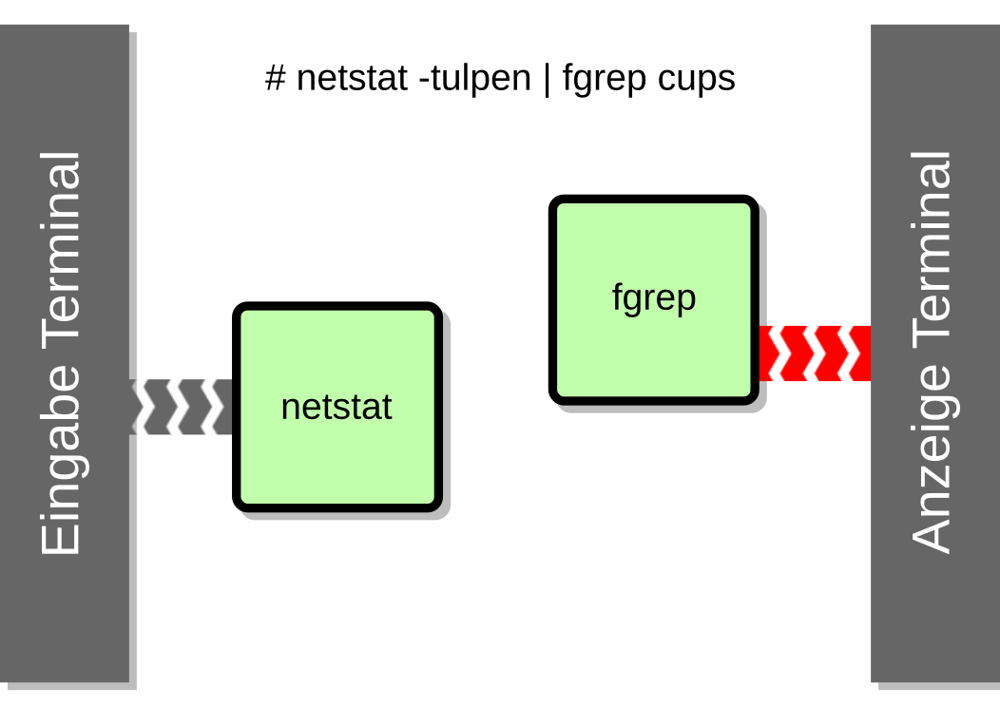

/////////////////////////////////////////////////////////////////////
Copyright (C) 2016 Sebastian Pipping <sebastian@pipping.org>
Licensed under CC-BY-SA-3.0
/////////////////////////////////////////////////////////////////////

:revealjs_theme: shell_we_continue
:revealjs_slideNumber: true
:revealjs_transition: fade

= $hell we continue?
Für mehr Shell im Alltag.

== Voraussetzungen:
Mit `cd`, `cp`, `mkdir`, `mv`, `rm`, `rmdir` umgehen können.

== Was dich erwartet:

=== Nicht-Ziele für heute
* Nicht bis ins letzte Detail gehen
* Keine Text-GUIs für E-Mail, Browser, ... vorstellen
* Keine Behandlung von Bash-Arrays
* Kaum "Parameter Expansion" à la `${i/alt/neu}`
* Weder POSIX-Shell noch zsh; im Fokus weiterhin: Bash

=== Ziele für heute
* Bausteine und Konzepte vorstellen:
** Path Resolution
** Signale, Jobs, Expansion
** Datenfluss/Piping, etwas Text-Processing
* Möglichkeiten und Fallen aufzeigen
* Praktisches für den Alltag in Bash, Skripting eher als Nebenprodukt

== Zum Ablauf
* Kurze Pause nach 60 Minuten
* _Verständnisfragen_ bitte gleich!

== Eine Bitte:

=== Bitte keine _Software_ in Bash schreiben.
* Langsam
* Schlechte Fehlerbehandlung
* Viel Ärger mit _Leerzeichen_
* Fließkomma-Zahlen (von Bash selbst) nicht unterstützt
* ...

Man _kann_ den nächsten https://github.com/cemeyer/httpd.sh[Webserver in Bash] schreiben,
_sollte_ aber nicht unbedingt.

== Terminal "reparieren"

=== `reset`: Terminal zurücksetzen
Terminal _kaputt machen_ zum Beispiel mit:
-------------------------------------
# python -c 'import curses; curses.initscr()'
-------------------------------------

Zurücksetzen / _reparieren_:
-------------------------------------
<Ctrl+C>
# reset
-------------------------------------

== Auflösung von Pfaden

=== Wie und warum findet Bash "cp" unter "/bin/cp"?

=== Verantworlich ist eine besondere Variable `${PATH}`:
------------------------
# echo "${PATH}"
/usr/local/bin:/usr/bin:/bin:/usr/local/games:/usr/games
------------------------

=== Auflösung von Pfaden
------------------------
# echo "${PATH}"
/usr/local/bin:/usr/bin:/bin:/usr/local/games:/usr/games
                        ^^^^
# which cp
/bin/cp

# type cp
cp is /bin/cp
------------------------

=== Eigene Pfade mit aufnehmen
------------------------
export PATH="${PATH}:${HOME}/bin"
------------------------
(Permanent via `~/.bashrc`)

=== Auflösung von Pfaden
------------------------
# echo -e '#! /bin/bash\necho Hello' > hello.sh
# chmod +x hello.sh

# ./hello.sh
Hello

# hello.sh
bash: hello.sh: command not found
------------------------
------------------------
# PATH="${PATH}:." hello.sh
Hello
------------------------

=== `.` in `${PATH}` 1/4
Aktuelles Verzeichnis mit aufnehmen:
------------------------
export PATH="${PATH}:."  # a) kann man machen
export PATH=".:${PATH}"  # b) STOP!
------------------------

=== `.` in `${PATH}` 2/4
------------------------
# ln -s /bin/rm cp
# cp datei{1,2}
------------------------

=== `.` in `${PATH}` 3/4
------------------------
# PATH="${PATH}:." cp datei1 datei2
cp: cannot stat 'datei1': No such file or directory

# PATH=".:${PATH}" cp datei1 datei2
cp: cannot remove 'datei1': No such file or directory
cp: cannot remove 'datei2': No such file or directory
------------------------

=== `.` in `${PATH}` 4/4
`man bash` -> PARAMETERS -> Shell Variables -> PATH:

> A zero-length (null) directory name in the value of
> PATH indicates the current directory.
> A null directory name may appear as two adjacent colons,
> or as an initial or trailing colon.

Beispiele:
------------------------
# export PATH="${PATH}::${HOME}/bin"  # naja
# export PATH="${PATH}:"
# export PATH=":${PATH}"  # STOP!
------------------------

== Signale

=== Vorweg: Was ist ein Prozess?
Ein Prozess ist ein _Programm in Ausführung_. +
Es hat einen Zustand, offene Dateien, belegt zeitweise CPU und Speicher.

=== Die wichtigsten Signale
* 2 = `SIG`*`INT`* -- `Ctrl+C`
* 9 = `SIG`*`KILL`*
* 15 = `SIG`*`TERM`*
* 18 = `SIG`*`CONT`*
* (19 = `SIG`*`STOP`*)
* 20 = `SIG`*`TSTP`* -- `Ctrl+Z`

(Für mehr: Siehe Ausgabe von `kill -l`)

=== Senden von Signalen
------------------------
# kill -KILL $(pgrep firefox)
------------------------
oder kürzer
------------------------
# pkill -KILL firefox
  ^
------------------------

== Jobs

=== Vorder- und Hintergrund
By Default: Anwendung bliebt im Vordergrund:
------------------------
# sleep $((5*60))
------------------------

Alternativ: Starten im Hintergrund:
------------------------
# sleep $((5*60)) &
# pid=$!
------------------------

=== Starten im Hintergrund
------------------------
# sleep $((5*60)) &
# pid=$!

# cat -v /proc/${pid}/cmdline
sleep^@300^@

# kill ${pid}
------------------------
Weitere relevante Builtins: `jobs`, `fg`, `bg`

== Typen: Was gibt es noch außer Variablen?

=== Typen
Neben Variablen kennt Bash die Typen:

* *`alias`*
* *`builtin`*
* `file`
* *`function`*
* `keyword`

Ermittelbar mit dem `type`-Builtin:
------------------------
# type -t sleep
file
------------------------

=== Aliase
Vorschläge für `~/.bashrc`:
-------------------------------
alias ls='ls -lhF --color=auto --group-directories-first'
-------------------------------
-------------------------------
alias grep='grep --color=auto -I'
-------------------------------
-------------------------------
alias ALARM='mplayer -loop 0 /path/to/alarm.mp3 &>/dev/null'
-------------------------------
(Den Alarm-Sound gibt es als http://creativecommons.org/licenses/by/3.0/[CC-BY] lizensiert
zum http://www.freesound.org/people/bone666138/sounds/198841/[Download auf freesound.org].)

=== Builtins
Ein paar wichtige Shell Builtins:

* `cd`
* `kill`
* `help`
* `history`
* `read`
* `type`

=== Funktionen
Wir könnten regelmäßiges

-------------------------------
# mkdir projekt19
# cd projekt19
-------------------------------

abkürzen zu

-------------------------------
# mkcd projekt19
-------------------------------

mit einer eigenen Funktion `mkcd`.

== Stolpersteine

=== `rm` mit Variablen
---------------------------------------
# rm -Rf "${MISSPELT}"/  # STOP!

# echo "${MISSPELT?}"/
bash: MISSPELT: parameter null or not set

# set -o nounset  # kurz: set -u

# echo "${MISSPELT}"/
bash: MISSPELT: unbound variable
---------------------------------------

=== sudo mit Umleitung 1/2
---------------------------------------
# sudo echo 1234 > /root/datei4
bash: /root/datei4: Permission denied
---------------------------------------
Problem: Umleitung nach `/root/datei4` benötigt bereits
Root-Rechte -- `sudo` kommt _zu spät_.

=== sudo mit Umleitung 2/2
---------------------------------------
# sudo echo 1234 > /root/datei4
bash: /root/datei4: Permission denied

# sudo bash -c 'echo 1234 > /root/datei4'
---------------------------------------

=== Bei Inline-Blöcken `;` vor `}`
---------------------------------------
hello() {
    echo Hello
}
---------------------------------------
Aber:
---------------------------------------
hello() { echo Hello ; }
                     ^
---------------------------------------

=== Globbing ohne Ergebnisse / nullglob 1/2
-------------------------------
# for i in *.pdf ; do echo "${i}" ; done ; echo Done.
-------------------------------

=== Globbing ohne Ergebnisse / nullglob 2/2
-------------------------------
# for i in *.pdf ; do echo "${i}" ; done ; echo Done.
*.pdf
Done.

# shopt -s nullglob

# for i in *.pdf ; do echo "${i}" ; done ; echo Done.
Done.
-------------------------------

=== Ausrufezeichen
-------------------------------
# echo 'Error!!!'
Error!!!

# echo {1..3}
1 2 3

# echo "Error!!!"  # History expansion
echo "Errorecho {1..3}!"
Errorecho {1..3}!

# sudo !!  # Letztes Kommando, diesmal mit sudo
-------------------------------

== Expansion

=== Expansion: Übersicht 1/2
* Brace Expansion
* Tilde Expansion
* Parameter and Variable Expansion
* Command Substitution
* Arithmetic Expansion
* Process Substitution
* Pathname Expansion
* History Expansion
* Word Splitting, Quote Removal

=== Expansion: Übersicht 2/2
* Brace Expansion -- `DSC_4650.{JPG,jpeg}`, `{1..3}`
* Tilde Expansion -- `~/projects/`
* Parameter and Variable Expansion -- `${3}`, `${HOME}`
* Command Substitution -- `$(pgrep thunderbird)`
* Arithmetic Expansion -- `$(``(5 * 1024**3)``)`
* Process Substitution -- `<(ps aux)`
* Pathname Expansion -- `*.txt`
* History Expansion -- `!-3`
* Word Splitting, Quote Removal

=== Brace Expansion
-------------------------------
# convert ~/Desktop/screenshot19.{png,jpeg}
-------------------------------

=== Arithmetic expansion
-------------------------------
# sleep $((5*60))
# sleep 5m
-------------------------------
-------------------------------
# truncate --size $((5 * 1024**3)) 5gib.img
# truncate --size 5g 5gib.img
-------------------------------
-------------------------------
# dd if=/dev/zero of=5gib.img bs=$((1024**2)) count=$((5*1024))
# dd if=/dev/zero of=5gib.img bs=M count=5k
-------------------------------

== Piping

=== Text processing
* `head -n 3`
* `tail -n 4`
* `grep`, `fgrep`
* `awk '{print $2}'`
* `sort`, `sort -u`
* `sed 's,alt,neu,g'`
* `tr`
* `column -t`

== Meine Top ~15

=== Top Hotkeys
* `Ctrl + C` -- `SIGINT`
* `Ctrl + D` -- EOF (End of file)
* `Ctrl + Z` -- `SIGTSTP`
* `Ctrl + L` -- `clear` (Bildschirm "löschen")
* `Alt + .`
* `Ctrl + R` -- Inkrementelle Suche

(Alle ohne `Shift`)

=== find und xargs 1/3
-------------------------------
# find -name '*.[ch]' | xargs kate &
-------------------------------

=== find und xargs 2/3
-------------------------------
# find -name '*.[ch]' -print0 | xargs -0 kate &
                      ^^^^^^^         ^^
-------------------------------

=== find und xargs 3/3
-------------------------------
# find -type f -name '*.[ch]' -exec kate {} + &
       ^^^^^^^                ^^^^^^^^^^^^^^^
-------------------------------

=== Zwischen zwei Ordnern vor- und zurück wechseln:
`cd -`

(Siehe auch `pushd`/`popd`)

=== Pipen an `less`:
`..``..``..``..``..``..`` | less`

=== Kopie von Ausgabe umlenken
`..``..``. |& tee log.txt`

=== Return-Code visualisieren
* `..``..``..``..``. ; echo $?`
* `..``..``..``..``. && echo GOOD`
* `..``..``..``..``. || echo FAILED >&2`
* `export PS1="\${?#0}${PS1}"`

=== `echo` als Testlauf vor Dinge schreiben
-----------------------
for i in ......... ; do
    echo mv "${i}" "${i%.log}.txt"
#   ^^^^
done
-----------------------

=== Rekursives `grep`
-----------------------
# fgrep -R  ....... .......
# fgrep -Rl ....... ....... | xargs sed -i ......
-----------------------

=== Brace Expansion
-----------------------
# mv ~/.thunderbird{,_BEFORE}`
-----------------------
-----------------------
# cp datei{,_BACKUP_2015-12-12}
-----------------------

=== xtrace Debugging aktivieren
-----------------------
set -x
-----------------------

oder

-----------------------
set -o xtrace
-----------------------

=== Rechner herunterfahren (wenn etwas fertig ist)
`sudo sh -c 'while pgrep emerge ; do \` +
`sleep 1 ; done ; poweroff'`

=== In neues Verzeichnis wechseln
-----------------------
mkcd() {
    local dir="$1"
    mkdir "${dir}" && cd "${dir}"
}

mkcd projekt19
-----------------------

=== In neues *Wegwerf*-Verzeichnis wechseln
`cd "$(mktemp -d)"`

=== Prozesse auflisten (mit Details)
`ps aux | fgrep ``..``..``..``..`

=== Über welche Dienste bin ich per Netzwerk angreifbar?
`sudo netstat -tulpen`

=== Was für lokale IP-Adressen hat mein System?
`ip addr`

=== Kontext von `cd` beschränken
`( cd path/to/folder && ..``..``..``..``. )`

=== Terminal reparieren
`<Ctrl+C>`, `reset`, `<Enter>`

=== Schreib-Anfragen persistieren
`sync`

== Bonus-Track: `/usr/bin/env`

=== `/usr/bin/env`
hat folgende Aufgaben:

. Umgebungsvariablen listen
. Programme mit anderer Umgebung aufrufen:
  * `env HOME=/foo ``..``..``..``..`
  * `env -i HOME=/foo ``..``..``..``..`
. Pfadauflösung _mit_ Ausführung

=== Beispiel-Wrapper für `cp`
------------------------
#! /usr/bin/env bash
# Wrapper around cp(1) with invocation echo
PS4='# '
set -x
exec /bin/cp "$@"
------------------------

== !
Diese Folien sind entstanden mit
https://fsfe.org/about/basics/freesoftware.de.html[100% freier Software],
konkret mit Hilfe von:

* http://asciidoctor.org/[Asciidoctor]
* https://github.com/asciidoctor/asciidoctor-reveal.js[asciidoctor-reveal.js]
* http://git-scm.com/[Git]
* https://www.gnu.org/software/make/[GNU make]
* https://inkscape.org/de/[Inkscape]
* http://lab.hakim.se/reveal-js/[reveal.js]

auf https://www.gentoo.org/[Gentoo Linux]
in http://kate-editor.org/[Kate/KWrite]
und https://yakuake.kde.org/[Yakuake].

== Selbst näher ansehen:
* Hardlinks, Softlinks, `/dev/null`
* coreutils -- `chroot`, `dd`, `tac`, ...
* procps -- `pidof`, `watch`, ...
* psmisc -- `killall`, `pstree`, ...
* util-linux -- `findmnt`, `losetup`, `lsblk`, ...
* `debootstrap`, `git`, `htop`, `kpartx`, `rsync`, `ssh`, `strace`, `tmux`
* http://beyondgrep.com/[`ack`],
    http://80386.nl/projects/hidesvn/distfiles/[`hidesvn`],
    http://optipng.sourceforge.net/[`optipng`],
    https://dev.yorhel.nl/ncdu[`ncdu`],
    http://www.ivarch.com/programs/pv.shtml[`pv`],
    http://mama.indstate.edu/users/ice/tree/[`tree`],
    http://www.vergenet.net/~conrad/software/xsel/[`xsel`]

== Fragen?!
Sebastian Pipping -- https://blog.hartwork.org/[Blog],
  mailto:sebastian@pipping.org[E-Mail],
  https://github.com/hartwork/[GitHub]
